# Project 1 — Virtual SOC Lab Setup (VirtualBox Internal Network)

## Objective
Design and build a fully isolated SOC lab that simulates real-world enterprise environments and supports future Blue Team activities such as SIEM monitoring, alert triage, threat hunting, and incident response.

---

## Lab Architecture Overview
- **Hypervisor:** Oracle VirtualBox  
- **Network Type:** Internal Network  
- **Network Name:** SOC-LAB  
- **Subnet:** 192.168.56.0/24  

This design ensures isolation from the internet, preventing noise and maintaining safe attack containment.

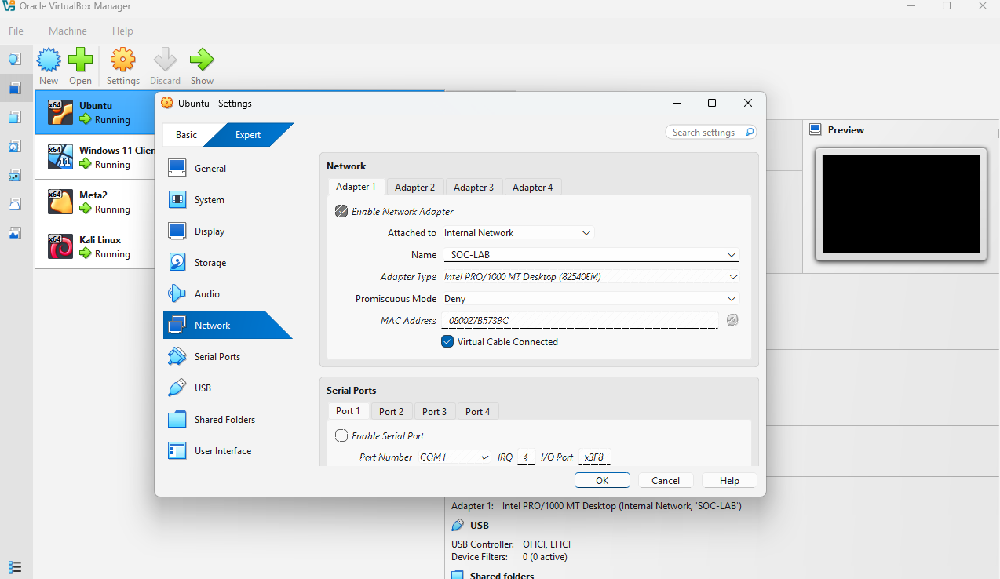

---

## Virtual Machines & Roles

| VM | Role | IP Address |
|---|---|---|
| Windows 11 | Endpoint (Wazuh Agent – future) | 192.168.56.10 |
| Ubuntu Desktop | SOC / Monitoring (Wazuh / ELK) | 192.168.56.20 |
| Metasploitable 2 | Vulnerable Target | 192.168.56.30 |
| Kali Linux | Attacker / Simulation | 192.168.56.40 |

---

## IP Address Verification

### Windows 11
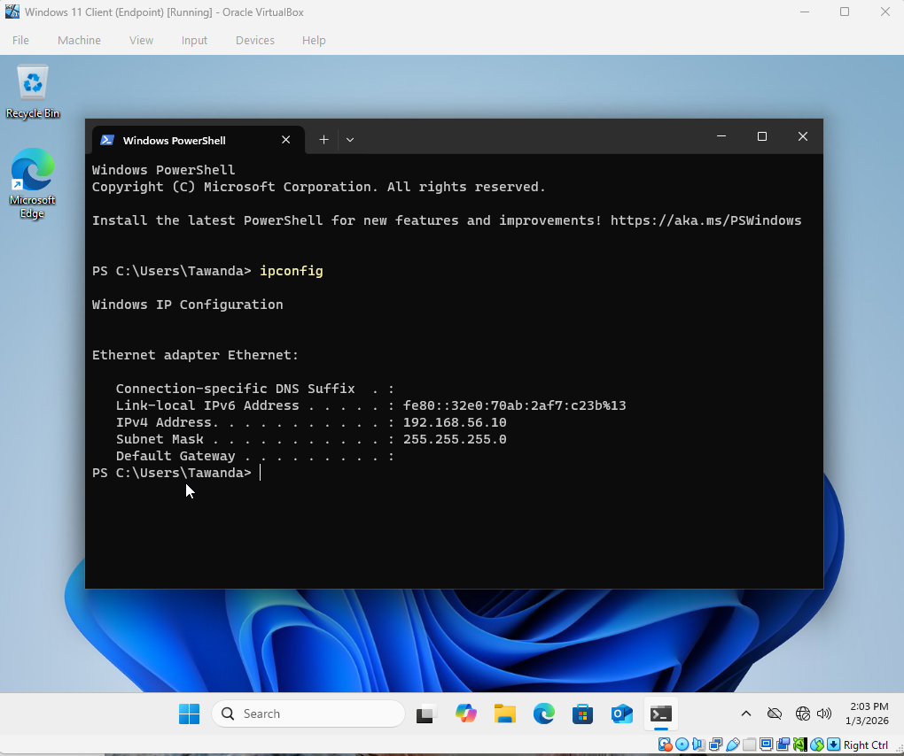

### Ubuntu Desktop
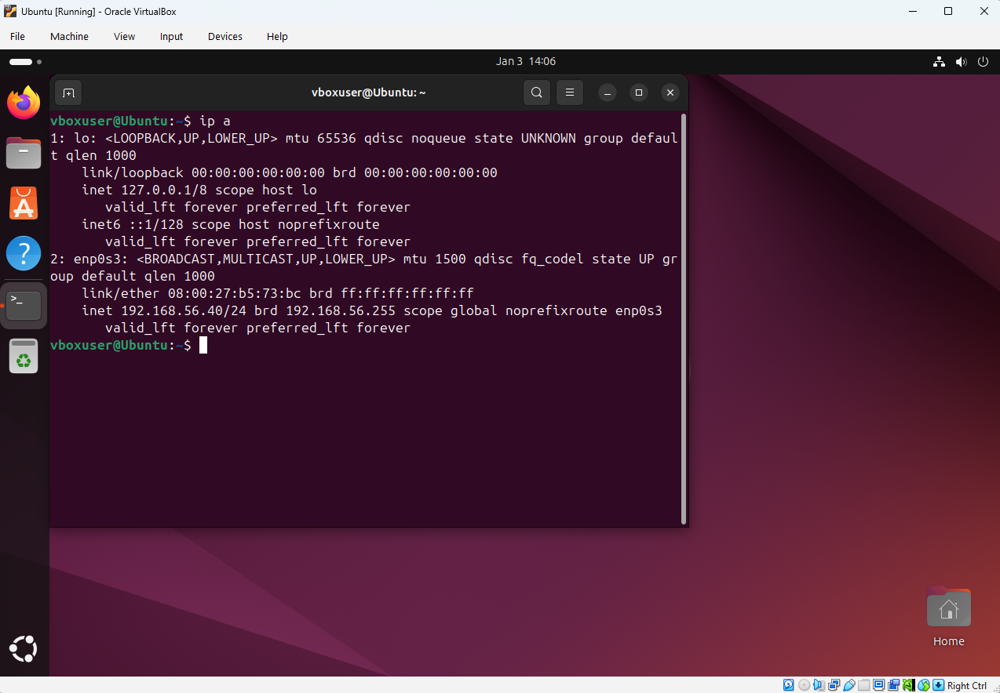

### Metasploitable 2
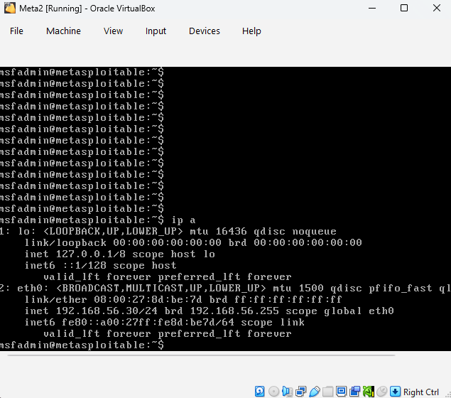

### Kali Linux
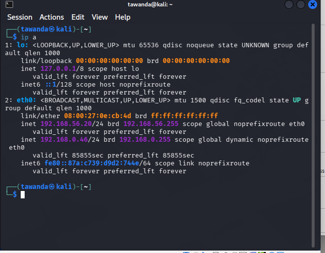---

## Connectivity Testing & Troubleshooting

### Initial Connectivity Failure
Inbound ICMP requests to Windows were blocked by Windows Defender Firewall.

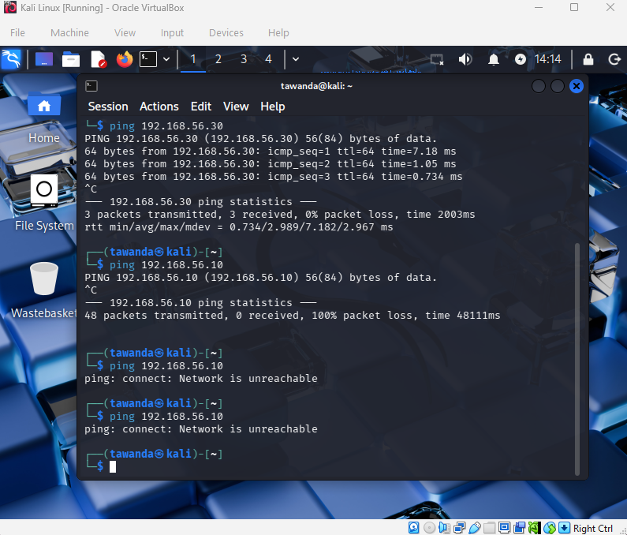

---

### Firewall Configuration (Controlled Change)

**Firewall Status Review**

**Inbound ICMP Rule Enabled**
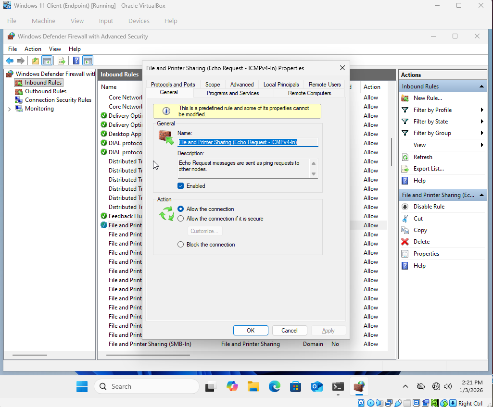

---

### Connectivity Restored

**Kali → Windows**
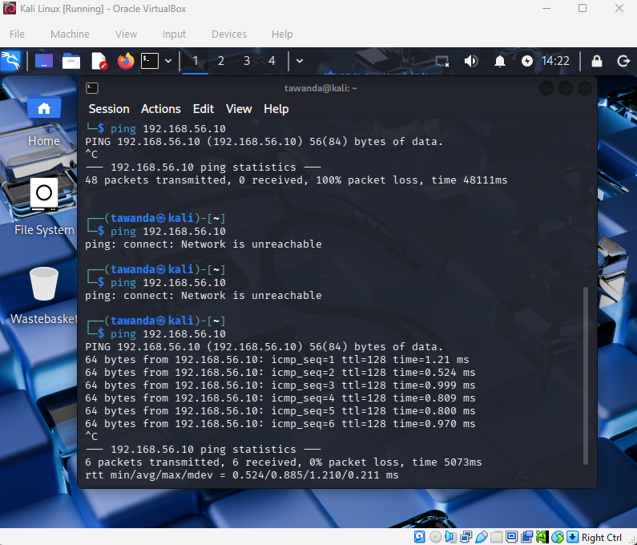

**Windows → Metasploitable**
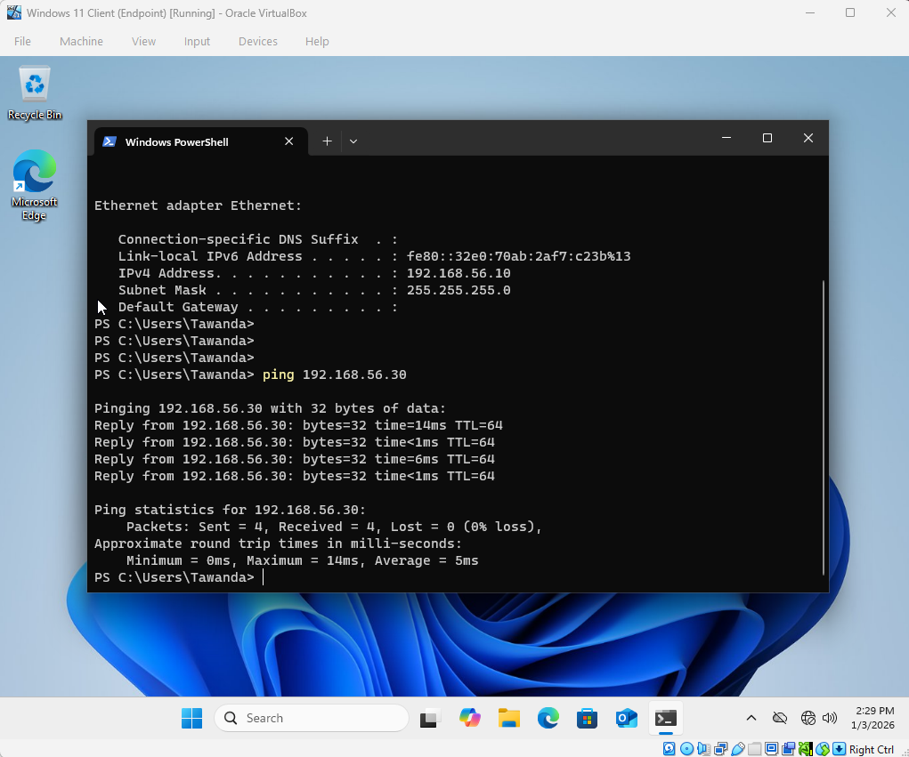

**Ubuntu → Kali**
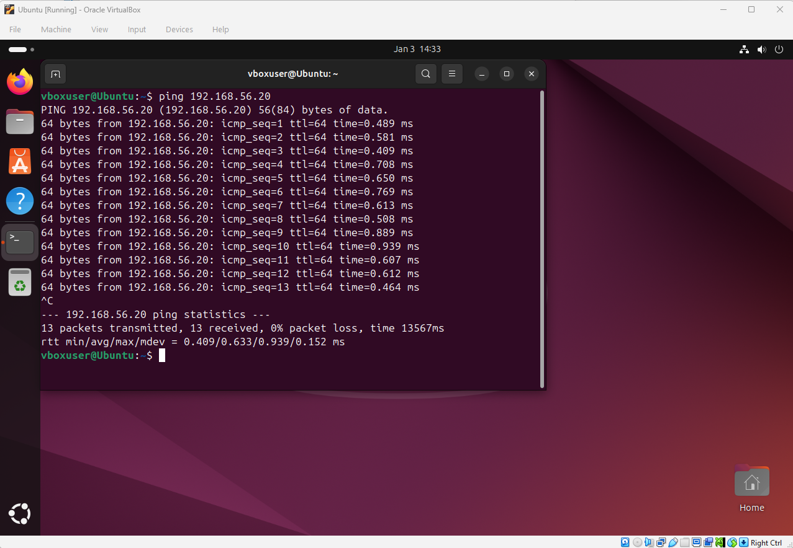

---

## Network Flow Diagram

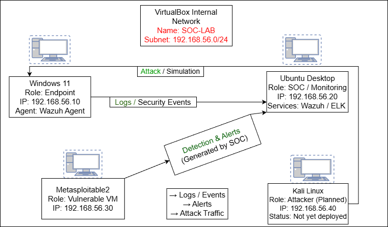

---

## Key Skills Demonstrated
- Secure lab isolation using internal networks  
- Static IP configuration across Windows & Linux  
- Network troubleshooting and firewall rule management  
- Documentation and structured lab design  
- SOC-oriented thinking and architecture  

---

## Next Steps
- Deploy Wazuh Manager on Ubuntu  
- Install Wazuh Agent on Windows  
- Generate attack telemetry and alerts  
- Perform alert triage and incident response simulations  

