# Project 02 — Wazuh SIEM SOC Lab (Windows Endpoint Monitoring)

## Overview

This project demonstrates the deployment, configuration, and operation of a small-scale **Security Operations Center (SOC) lab** using **Wazuh SIEM** to monitor a Windows 11 endpoint.

The objective was not simply to install tools, but to **validate real SOC workflows** including secure network design, endpoint onboarding, log ingestion verification, detection engineering, alert investigation, MITRE ATT&CK mapping, and structured troubleshooting.

This lab simulates the responsibilities of a **junior SOC analyst** working with endpoint telemetry in a controlled environment.

---

## Lab Architecture

- **Ubuntu SOC VM** — Wazuh Manager, Indexer, and Dashboard
- **Windows 11 Endpoint** — Monitored system with Wazuh Agent
- **VirtualBox** — Hypervisor
- **Network Model**
  - Internal Network (`SOC-LAB`) for secure agent-to-manager communication
  - Temporary NAT adapter used only when operationally required

This architecture mirrors real-world SOC environments where endpoints are isolated and outbound access is restricted by default.

---

## 1. Wazuh Manager Validation

The Wazuh manager was successfully deployed and accessed from the Ubuntu SOC VM.  
This step confirmed that the SIEM backend services (manager, indexer, dashboard) were operational before onboarding any endpoints.

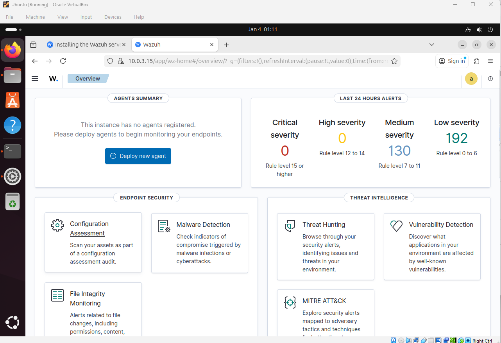

---

## 2. Secure Network Configuration

The Ubuntu SOC VM was configured with **dual network adapters**:

- **Adapter 1:** Internal Network (`SOC-LAB`) — agent ↔ manager traffic
- **Adapter 2:** NAT — temporary outbound access during setup

This design demonstrates **security-first thinking**:
- Isolation by default
- Controlled outbound access
- No permanent internet exposure for SOC infrastructure

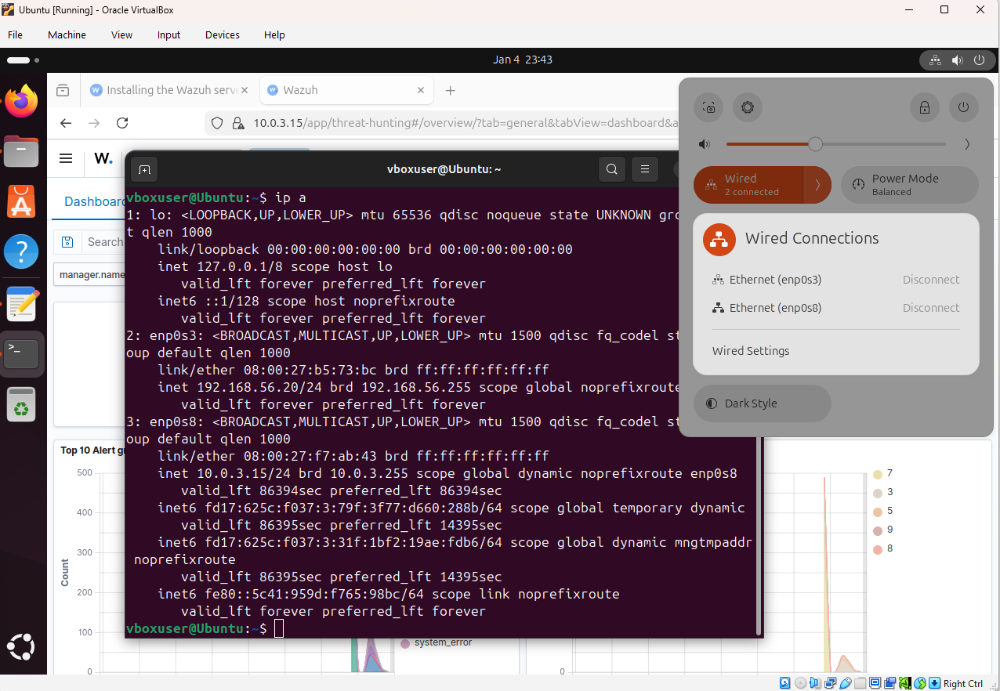

---

## 3. Windows Endpoint Agent Installation

The Wazuh agent was installed on the Windows 11 endpoint and configured to communicate with the manager over the internal SOC network.

This step establishes the endpoint as a monitored asset capable of sending logs, file integrity data, and security events.

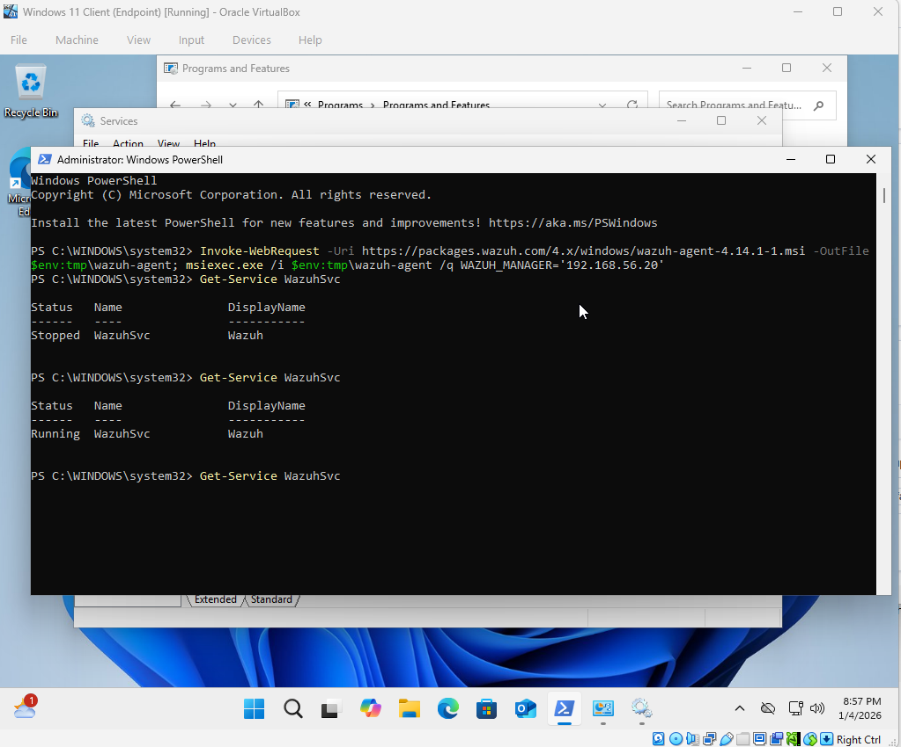

---

## 4. Agent Registration & Connectivity (Critical)

The Windows endpoint successfully registered with the Wazuh manager and began sending keepalive messages.

This confirms:
- Correct IP addressing
- Network reachability
- Agent–manager trust relationship

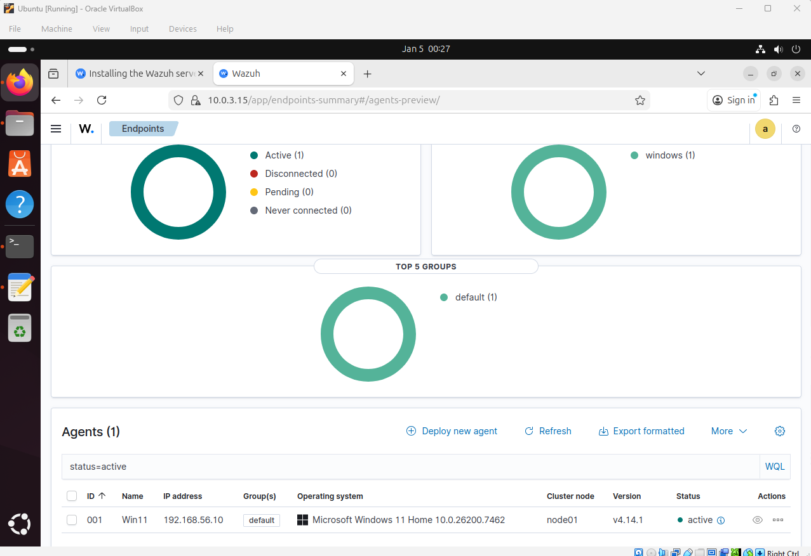

---

## 5. Endpoint Visibility & Metadata

Detailed endpoint metadata is visible within the Wazuh dashboard, including:
- Operating system
- IP address
- Agent status
- Last keepalive timestamp

This validates continuous monitoring and endpoint health visibility.

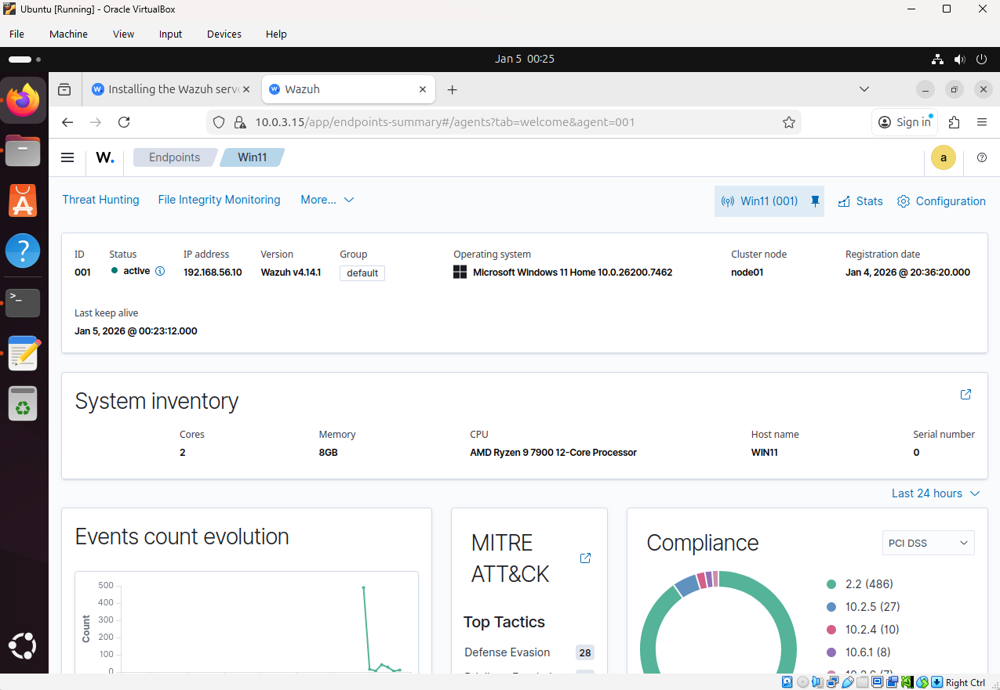

---

## 6. Initial No-Event State (Validation)

Immediately after onboarding, the dashboard showed no alerts or notable activity.

This is an **expected and healthy state**, confirming that alerts are driven by telemetry and behaviour rather than misconfiguration.

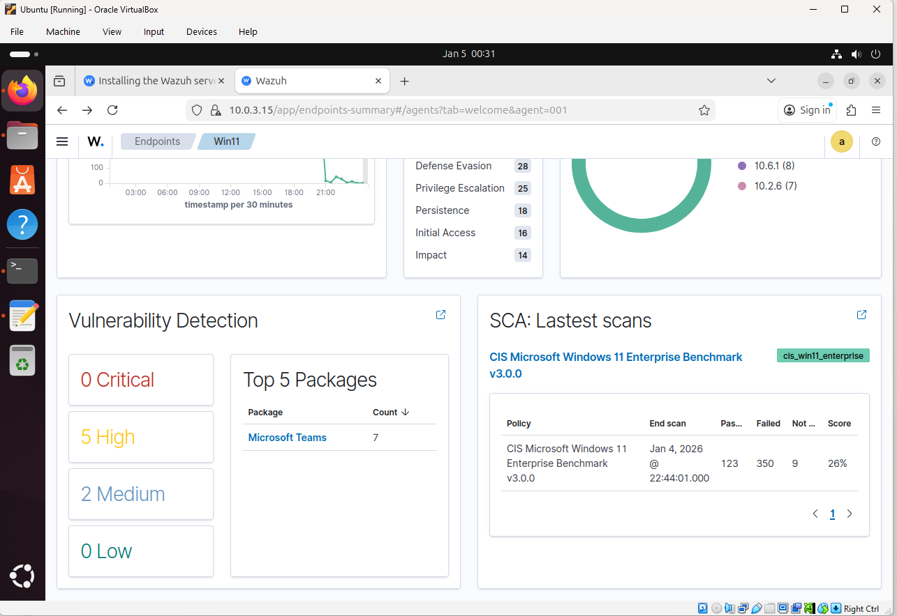

---

## 7. File Integrity Monitoring Configuration

File Integrity Monitoring (FIM) was configured on the Windows agent to monitor a user-accessible directory:

Real-time monitoring was enabled to ensure immediate alert generation upon file creation or modification.

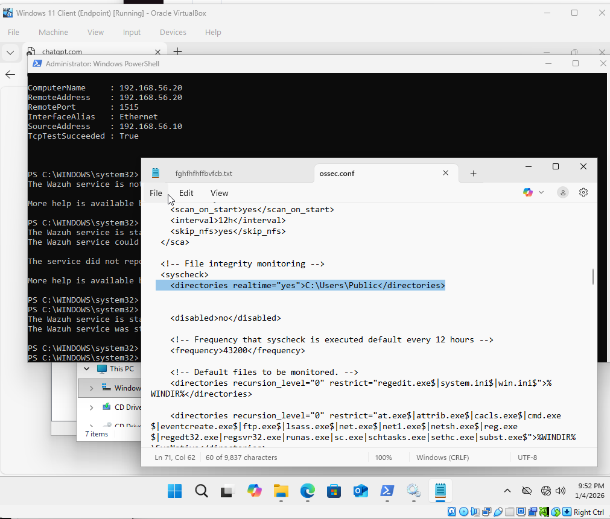

This demonstrates configuration-level control rather than reliance on default settings.

---

## 8. Log Ingestion Confirmed

After generating activity on the Windows endpoint, logs began appearing within Wazuh.

Observed telemetry included:
- Windows Security events
- File Integrity Monitoring alerts
- System activity logs

This confirms successful **end-to-end log ingestion**.

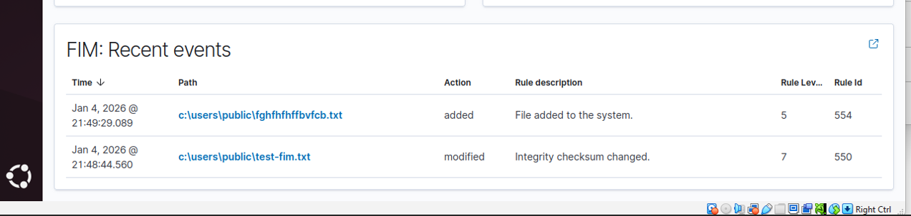

---

## 9. Detection — Failed Logon Attempts

Multiple failed authentication attempts were generated on the Windows endpoint.

- **Windows Event ID:** 4625
- **Detection Type:** Authentication failure
- **MITRE ATT&CK:** T1110 — Brute Force

The activity was successfully ingested, correlated, and displayed within the Threat Hunting view.

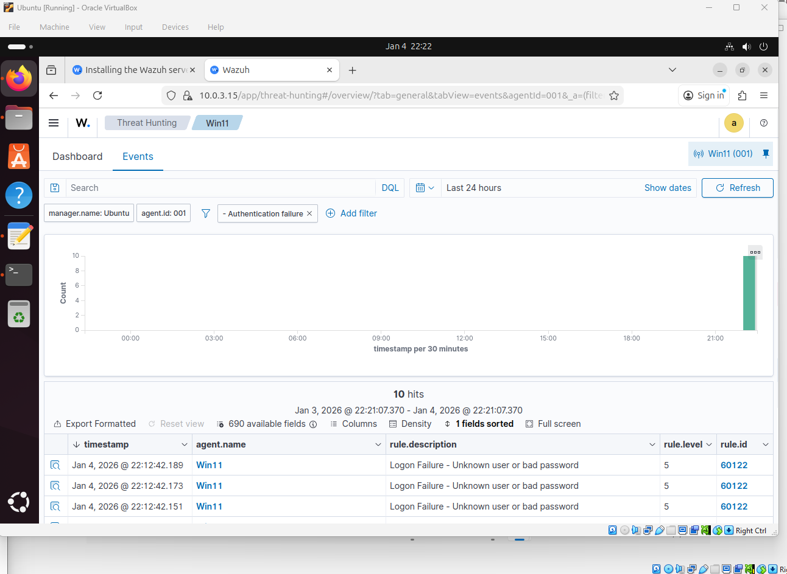

---

## 10. Detection — Unauthorized Service Creation

To simulate persistence behaviour, a Windows service was created using `sc.exe`.

- **Windows Event ID:** 4697
- **Detection Type:** New Windows Service Created
- **MITRE ATT&CK:** T1543.003 — Create or Modify System Process: Windows Service

This represents a common attacker persistence technique.

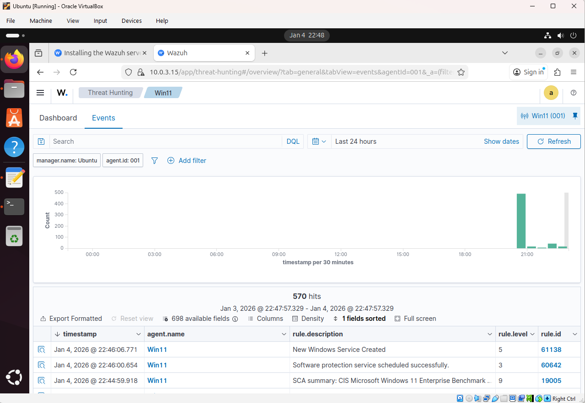

---

## 11. MITRE ATT&CK Mapping

Detected activity was automatically mapped to **MITRE ATT&CK tactics and techniques** within Wazuh.

This provides analysts with:
- Behavioural context
- Threat classification
- Framework-aligned detection visibility

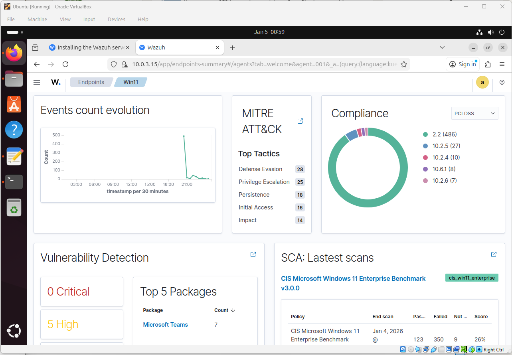

---

## 12. Alert Detail & Timeline Analysis

Alert detail views were used to investigate event metadata, including:
- Rule ID and severity
- Timestamp and source host
- Account and process context
- Event message and log channel

### Failed Logon Event Details
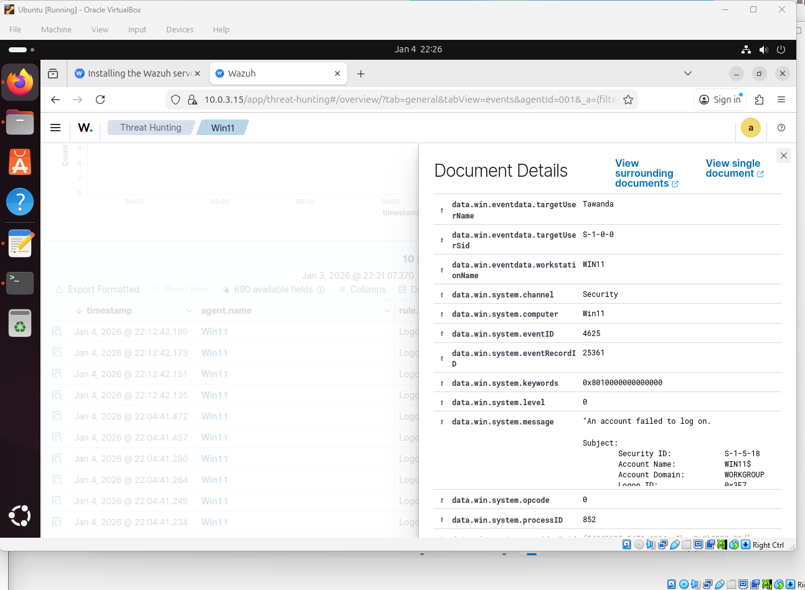

### Service Creation Event Details

---

## Troubleshooting & Operational Challenges

### Issue 1 — Agent Installer Failed to Download

**Cause:**  
The Windows endpoint was intentionally isolated on an internal network with no internet access, preventing DNS resolution and external downloads.

**Resolution:**  
- Temporarily added a NAT adapter
- Installed and registered the Wazuh agent
- Removed NAT adapter post-installation

**Outcome:**  
SOC isolation was preserved while enabling controlled installation access.

---

### Issue 2 — No Events Appearing

**Cause:**  
No endpoint activity was occurring and default FIM paths did not include user-accessible directories.

**Resolution:**  
- Updated `ossec.conf`
- Enabled FIM on `C:\Users\Public`
- Generated authentication failures and file changes

**Outcome:**  
Telemetry ingestion and alert generation were successfully validated.

---

## Project Outcomes

This project demonstrates practical SOC capabilities including:

- SIEM deployment and validation
- Secure network architecture
- Endpoint onboarding and troubleshooting
- Windows Security log analysis (Event ID 4625)
- File Integrity Monitoring configuration
- Persistence detection via service creation
- MITRE ATT&CK mapping
- SOC-style alert investigation and documentation

---

## Conclusion

This lab demonstrates an end-to-end SOC workflow — from infrastructure deployment and secure networking to detection, investigation, and analysis.

Rather than focusing solely on alerts, the project validates telemetry, documents operational challenges, and applies analyst frameworks to detections, reflecting real-world SOC practices.

